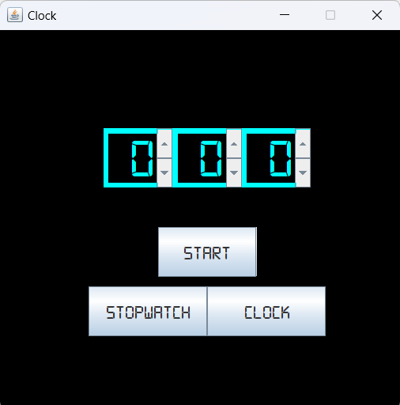
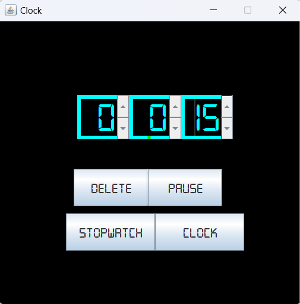
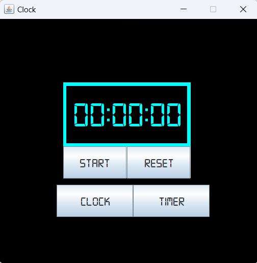
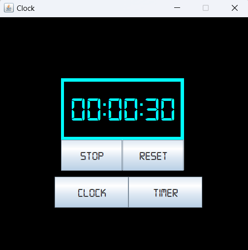
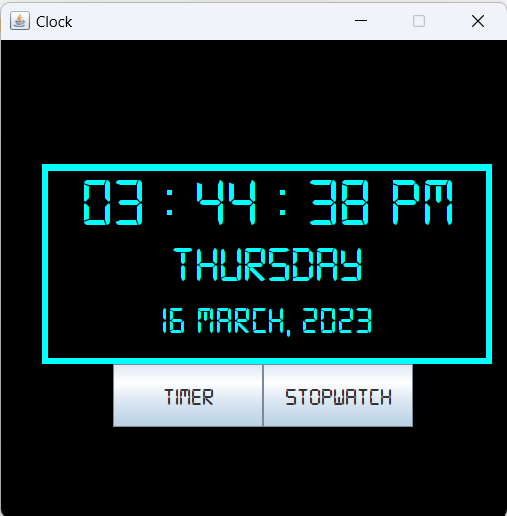

# Digital Clock

A simple Java application that displays a digital clock with additional features, including a stopwatch and a timer.

## Table of Contents
- [Overview](#overview)
- [Features](#features)
- [How to Use](#how-to-use)
- [Screenshots](#screenshots)
- [Technical Details](#technical-details)
- [License](#license)

## Overview

Digital Clock is a Java application that provides a user-friendly digital clock interface with additional functionality, including a stopwatch and a timer. This project showcases the use of Java Swing for creating a graphical user interface (GUI) and demonstrates the integration of custom fonts for an appealing visual design.

## Features

- Real-time digital clock display with time, day, and date information.
- Stopwatch functionality with options to start, stop, and reset.
- Timer functionality with the ability to set a countdown time and start/pause/resume the timer.

## How to Use

To use the Digital Clock application:

1. Ensure you have Java installed on your system.

2. Compile the Java files using `javac`:
    ```
    javac DigitalClock/Main.java DigitalClock/MainFrame.java DigitalClock/Clock.java DigitalClock/StopWatch.java DigitalClock/TimerT.java
3. Run the application using `java`:
    ```
    java DigitalClock.Main
4. The Digital Clock GUI will appear with options to switch between the clock, stopwatch, and timer.

5. Use the buttons to control the stopwatch and timer as needed.

## Screenshots


<br><br><br><br>

<br><br><br><br>

<br><br><br><br>

<br><br><br><br>

<br><br>

## Technical Details

- **Technologies Used**: Java, Java Swing
- **Custom Font**: The project uses a custom font (digital-7.ttf) to style the text in the GUI.

## License

This project is created for practice purposes and does not include a specific license. You are free to use, modify, and distribute the code as per your own discretion. However, it's always a good practice to give credit to the original author if you decide to use or share this code.
